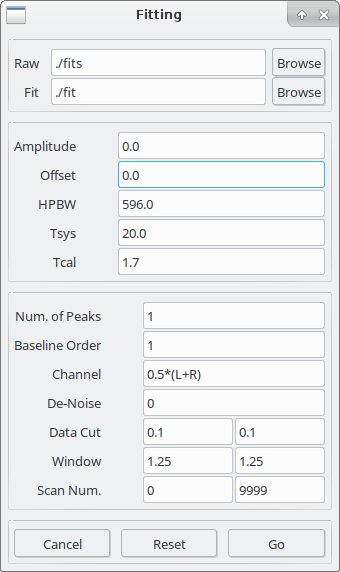
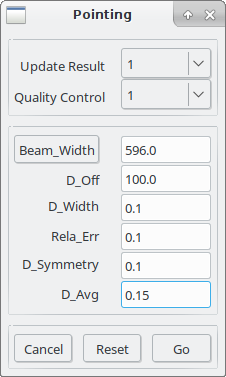
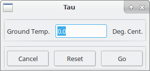
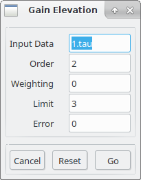
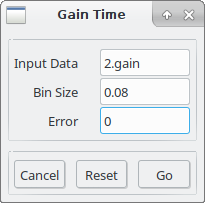
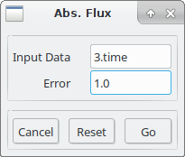

# DAARC

DAARC: Data Analysis Application for Radio Continuum

DAACR provides an end-to-end solution for radio continuum data from single dish cross-scan observation.

## installation

Dependence:

- numpy and scipy
- ppgplot
- astropy
- ephem
- wx
- pubsub

Installation:

`python setup.py install`

## a brief introduction

## standard data calibration procedures

Here we list the standard procedures for data calibration

### Gaussian fitting

 The first step of data calibration is usually Gaussian fitting, which is sensible as the observing targets are mostly 'point-like' to the antenna beam. The equation applied for the fitting is a combination of multiple-peak Gaussian and a linear function, i.e.,

This is essentially powerful to minimize the influence of source confusion (or side lobe) and baseline drifting. 

- data location:
  - `Raw`: the location of raw FITS data (use `Browse` to locate it)
  - `Fit`: the location of the Gaussian fitted ascii results (use `Browse` to locate it)

- parameter setup
  - `Amplitude`: initial guess of amplitude (A in Eq. 1)
  - `Offset`: initial guess of offset (X0 in Eq. 1)
  - `HPBW`: initial guess for antenna beam width (H in Eq. 1)
  - `Tcal`: the strength of noise diode in Kelven
  - `Num. of Peaks`: the number of Gaussian functions (N in Eq. 1)
  - `Baseline Order`: the order of baseline. By default a linear function is fitted to the baseline. Higher order of baseline is possible, however this is in priciple not expected for a sub-scan, and may introduce over fitting.
  - `Channel`: stokes (R, L, RL, LR) or their combinations (e.g., 0.6\*R + 0.4\*L)
  - `De-Noise`: factor (n) controlling the strength of data smoothing. If , the data is smoothed regressively with  piecewise cubic spline algorithm, data points over n times the rms are filtered. The larger n the less smoothing. Typical value of n is higher than 3 even if smoothing is needed.
  - `Data Cut`: Restricts the range of the Gaussian fit in scanning direction on the left and right. By default both values are 0.1, which means that 10% of data are reduced in both sides.
  - `Window`: factor (n) defines the location of the first null of the antenna beam pattern. The location is calculated as , where  and  are the offset and HPBW from Gaussian fitting, respectively .
  - `Scan Num.` starting and ending scans to be fitted.

- buttons

- - `Cancel`: cancel the settings and close the fitting dialog
  - `Reset`: reset the fitting parameters
  - `Go`: start Gaussian fitting

  

### pointing correction

### air opacity correction

### gain-elevation correction

### gain-time correction

### absolute flux density conversion

